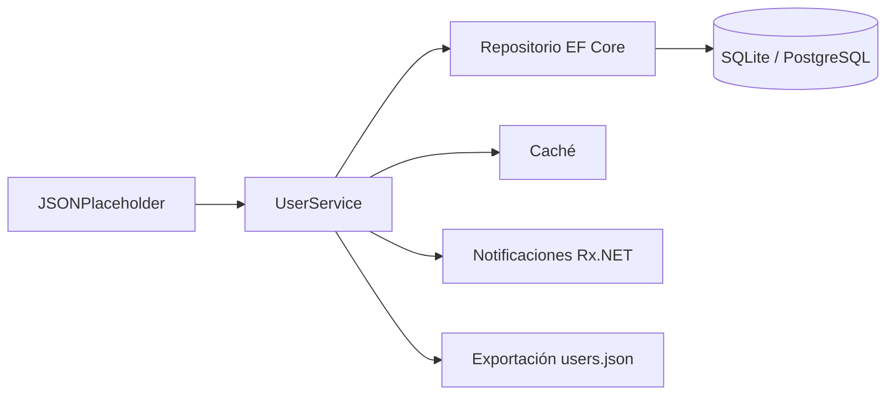

# RepositorioRemoto.Back

> Práctica 6 · Servicio con base local, API remota, caché, sincronización y pruebas en .NET.

**Autoras:** Lucía Fuertes Cruz y Laura Santamaria Parra  
**Asignatura:** Entorno Servidor  
**Curso:** 2º DAW  
**Proyecto:** `RepositorioRemoto.Back`

---

## ✨ Descripción

Este proyecto implementa un servicio de gestión de usuarios en .NET que trabaja con tres partes principales:

- una **API remota** basada en JSONPlaceholder;
- una **base de datos local** con EF Core;
- una **caché** para acelerar consultas por identificador.

La práctica está pensada para comprobar el flujo completo de una aplicación de servidor: consulta de datos, creación, actualización, eliminación, sincronización periódica, validación, control de errores, notificaciones reactivas, exportación a JSON y pruebas automatizadas.

---

## 🧩 Tecnologías utilizadas

| Tecnología | Uso en el proyecto |
|---|---|
| .NET / C# | Desarrollo del servicio y programa de pruebas |
| EF Core | Acceso a base de datos local |
| SQLite | Base de datos en entorno Development |
| PostgreSQL | Base de datos en entorno Production |
| MemoryCache | Caché en memoria para Development |
| Redis | Caché externa para Production |
| Refit | Cliente HTTP tipado para JSONPlaceholder |
| CSharpFunctionalExtensions | Uso de `Result<T, DomainError>` |
| Scrutor | Registro automático de dependencias |
| System.Reactive | Servicio de notificaciones con `IObservable` |
| Serilog | Logs por consola y niveles de depuración |
| NUnit | Framework de pruebas |
| Moq | Simulación de dependencias en tests |
| FluentAssertions | Aserciones más legibles |
| Testcontainers | Pruebas con Redis y PostgreSQL reales |
| Report Coverage | Revisión exacta de cobertura por línea |
| Docker Compose | Ejecución de la aplicación e infraestructura |

---

## 📁 Estructura principal

```text
RepositorioRemoto.Back/
├── Api/                  # Cliente Refit para JSONPlaceholder
├── Cache/                # Implementaciones de MemoryCache y Redis
├── Config/               # Configuración por entorno
├── Dto/Users/            # DTOs de entrada y salida
├── Entity/               # DbContext de SQLite y PostgreSQL
├── Errors/               # Errores personalizados del dominio
├── Infrastructure/       # Registro de dependencias y extensiones
├── Mappers/              # Conversión entre DTOs, JSON y modelos
├── Models/               # Modelo de dominio
├── Notifications/        # Contrato de notificaciones
├── Repositories/         # Repositorio EF Core
├── Services/             # UserService y BackgroundService
├── Storage/              # Exportación de usuarios a JSON
├── Validator/            # Validadores de User, Address y Company
└── Program.cs            # Programa de prueba y demostración
```

---

## 🔄 Funcionamiento general



El servicio central es `UserService`. Desde ahí se coordinan las llamadas a la API, el repositorio, la caché, la validación, las notificaciones y la exportación.

### Lecturas

- `GetAllAsync()` devuelve los usuarios locales si existen.
- Si no hay datos locales, consulta la API remota y devuelve el resultado.
- `GetByIdAsync()` sigue el orden: **caché → base de datos → API**.
- Cuando se obtiene un usuario por ID desde base de datos o API, se añade a la caché.

### Escrituras

- `CreateAsync()` valida el usuario, llama a la API, guarda en base de datos y lanza una notificación.
- `UpdateAsync()` comprueba que el usuario exista, actualiza en API, actualiza en base de datos y notifica.
- `DeleteAsync()` elimina en API, elimina en base de datos, limpia la clave de caché y notifica.

> En `CreateAsync` y `UpdateAsync` no se fuerza la escritura en caché, ya que crear o actualizar un usuario no implica que se vaya a consultar inmediatamente después.

---

## ⚙️ Configuración por entorno

El proyecto usa dos configuraciones principales:

| Entorno | Base de datos | Caché |
|---|---|---|
| Development | SQLite | MemoryCache |
| Production | PostgreSQL | Redis |

La configuración se carga desde:

```text
appsettings.development.json
appsettings.production.json
```

El entorno se pasa como argumento al arrancar la aplicación:

```bash
dotnet RepositorioRemoto.Back.dll Development
```

```bash
dotnet RepositorioRemoto.Back.dll Production
```

---

## 🐳 Ejecución con Docker

### Development: SQLite + MemoryCache

En este modo no se levantan contenedores extra para base de datos ni Redis.

```bash
docker compose up -d --build
```

En el `Dockerfile`, el `ENTRYPOINT` debe arrancar en `Development`:

```dockerfile
ENTRYPOINT ["dotnet", "RepositorioRemoto.Back.dll", "Development"]
```

### Production: PostgreSQL + Redis

Para producción se usa el perfil `prod` de Docker Compose:

```bash
docker compose --profile prod up -d --build
```

En el `Dockerfile`, el `ENTRYPOINT` debe arrancar en `Production`:

```dockerfile
ENTRYPOINT ["dotnet", "RepositorioRemoto.Back.dll", "Production"]
```

Servicios usados en producción:

```text
backend        Aplicación .NET
postgres_db    Base de datos PostgreSQL
redis_cache    Caché Redis
```

---

## 🔔 Notificaciones

El proyecto incluye un servicio de notificaciones con Rx.NET.

Cuando se crea, actualiza o elimina un usuario, `UserService` emite una notificación. En `Program.cs` se realiza la suscripción al observable para mostrar el mensaje por consola.

Tipos de notificación:

```text
Create
Update
Delete
```

---

## ⏱️ Sincronización automática

El `BackgroundService` ejecuta una sincronización periódica cada 60 segundos.

Durante el proceso:

1. Se limpia la caché.
2. Se limpia la base local.
3. Se consulta la API remota.
4. Se vuelve a cargar la copia local de usuarios.

Este proceso permite mantener una copia local actualizada respecto a la API remota.

---

## 📤 Exportación a JSON

El proyecto permite generar un fichero `users.json` bajo demanda.

La exportación:

- obtiene los usuarios desde el repositorio;
- serializa los datos con `System.Text.Json`;
- crea la carpeta de destino si no existe;
- escribe el fichero con codificación UTF-8.

> El JSON no se usa como base de datos principal. Solo es una exportación de datos.

---

## 🧪 Testing

El proyecto incluye pruebas sobre distintas partes de la aplicación:

- modelos y DTOs;
- mapeadores;
- validadores;
- caché MemoryCache;
- caché Redis;
- DbContext de SQLite y PostgreSQL;
- repositorio EF Core;
- `UserService`;
- `BackgroundService`;
- servicio de notificaciones;
- exportación a JSON.

Los tests siguen el patrón **AAA**:

```text
Arrange → Act → Assert
```

También se usa `Verify` de Moq para comprobar que ciertas dependencias se llaman, por ejemplo API, repositorio, caché o notificaciones.

### Ejecutar tests

```bash
dotnet test
```

### Cobertura con Report Coverage

Para generar cobertura:

```bash
dotnet test --collect:"XPlat Code Coverage"
```

Después se puede generar un informe HTML con ReportGenerator:

```bash
reportgenerator \
  -reports:"**/coverage.cobertura.xml" \
  -targetdir:"coveragereport" \
  -reporttypes:Html
```

Esto permite revisar no solo el porcentaje global, sino también qué líneas concretas quedan cubiertas y cuáles no.

---

## 🧠 Decisiones de diseño

- Se usa `Result<T, DomainError>` para evitar depender de excepciones como flujo normal de negocio.
- Los errores están separados por responsabilidad: servicio, repositorio, usuarios y exportación.
- Los mapeadores son manuales para controlar mejor la conversión entre DTOs y modelo.
- La configuración cambia por entorno sin modificar `UserService`.
- La caché se usa principalmente en consultas por ID.
- La exportación JSON está separada en `UserStorage`.
- Scrutor ayuda a reducir registros manuales de dependencias.

---

## ✅ Resumen rápido

```text
API remota        JSONPlaceholder
Base local dev    SQLite
Base local prod   PostgreSQL
Caché dev         MemoryCache
Caché prod        Redis
Errores           Result<T, DomainError>
Notificaciones    Rx.NET
Pruebas           NUnit + Moq + FluentAssertions
Cobertura         Report Coverage
Despliegue        Docker Compose
```

---

## 👩‍💻 Autoras

**Lucía Fuertes Cruz**  
**Laura Santamaria Parra**

2º DAW · Entorno Servidor
